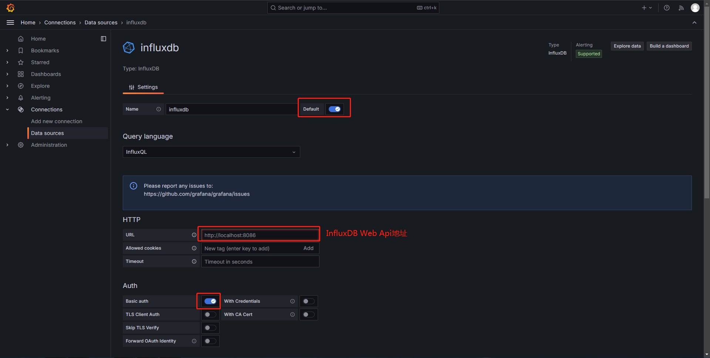
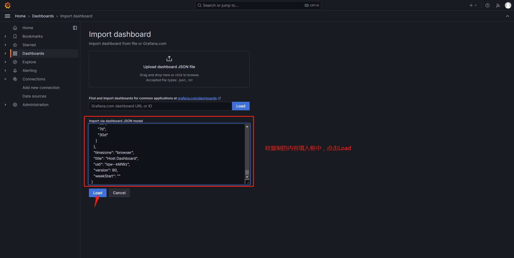

# Install Grafana

### 官网页面
```shell
https://grafana.com/grafana/download
```

### 安装依赖包
#### ***For EL7 & EL8***
```shell
yum install wget
```
#### ***For Ubuntu 22***
```shell
apt install wget libfontconfig1 musl
```

### 安装
#### ***For EL7***
>`下载安装包`
```shell
wget https://dl.grafana.com/enterprise/release/grafana-enterprise-11.4.0-1.x86_64.rpm
```
>`安装`
>`EL7可能提示rpm命令版本过低，添加--nodeps跳过rpm版本检查`
```shell
rpm -ivh grafana-enterprise-11.4.0-1.x86_64.rpm --nodeps
```
>`启动`
```shell
systemctl enable --now grafana-server
```
#### ***For EL8***
>`下载安装包`
```shell
wget https://dl.grafana.com/enterprise/release/grafana-enterprise-11.4.0-1.x86_64.rpm
```
>`安装`
```shell
rpm -ivh grafana-enterprise-11.4.0-1.x86_64.rpm
```
>`启动`
```shell
systemctl enable --now grafana-server
```
#### ***For Ubuntu 22***
>`下载安装包`
```shell
wget https://dl.grafana.com/enterprise/release/grafana-enterprise_11.4.0_amd64.deb
```
>`安装`
```shell
dpkg -i grafana-enterprise_11.4.0_amd64.deb
```
>`启动`
```shell
systemctl enable --now grafana-server
```

### 配置
>`浏览器访问Grafana Web`
>`IP:3000`
>`默认账号密码：admin:admin`

>`添加数据源`





>`浏览器访问以下地址`
>`全选并复制网页内容`
```shell
https://raw.githubusercontent.com/yang66887/Nagios/refs/heads/main/Grafana/Host%20Dashboard.json
```
>`导入Dashboard`




