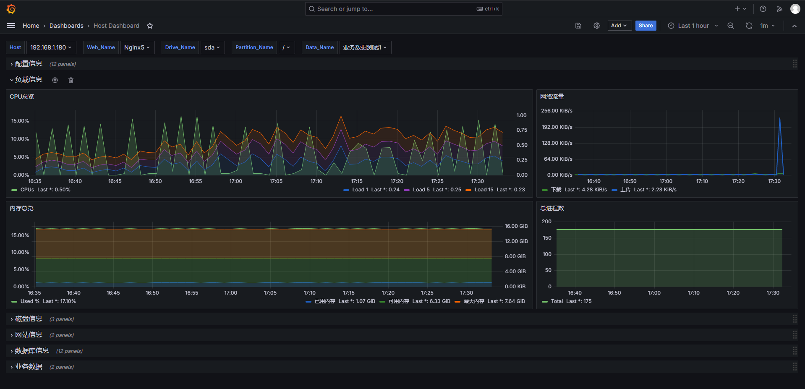

## Nagios Core + Nagios Plugins + NCPA + InfluxDB + Nginx +Grafana

### 部署架构

## For Nagios Server

1、[Install Nagios Core](./Nagios_Core/Install.md)

2、[Install PHP 8](./PHP/Install.md)

3、[Install Nginx](./Nginx/Install.md)

4、[Install Nagios Plugins](./Nagios_Plugins/Install.md)

5、[Install InfluxDB](./InfluxDB/Install.md)

6、[Install Grafana](./Grafana/Install.md)

7、[Install Custom Plugins](./Custom_Plugins/Install.md)

8、[Nagios Configure](./Nagios_etc/Configure.md)

## For NCPA Server

1、[Install NCPA](./NCPA/Install.md)

2、[Install Nagios Plugins](./Nagios_Plugins/Install.md)

## Grafana效果示例

#### 新增进程列表采集与展示

